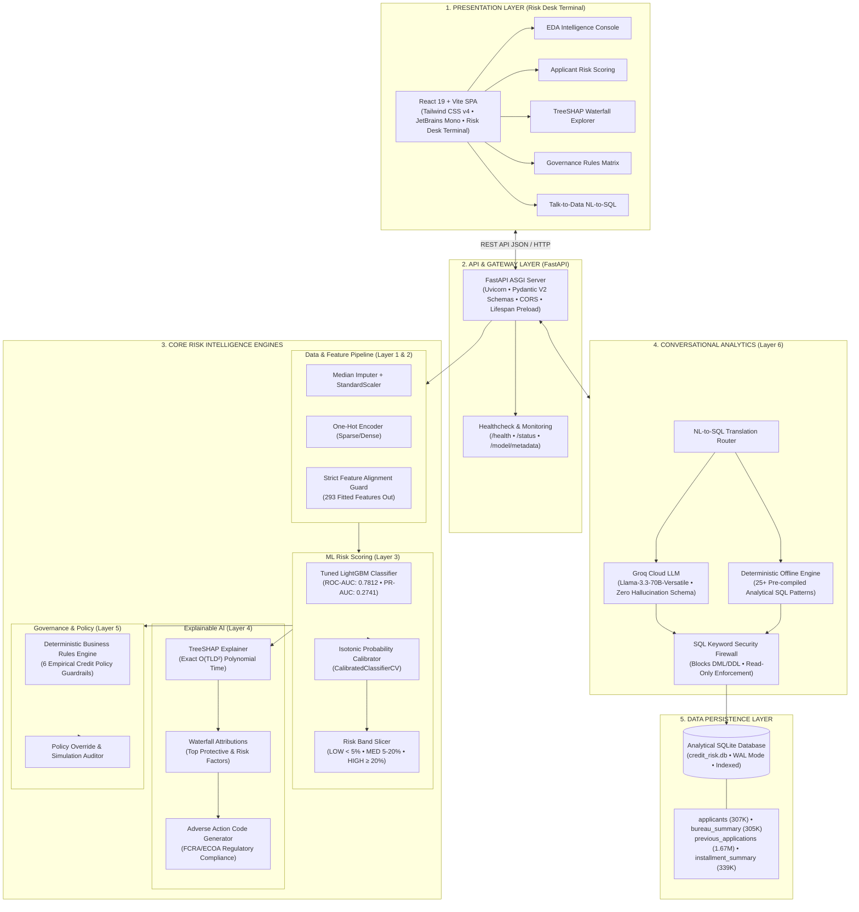
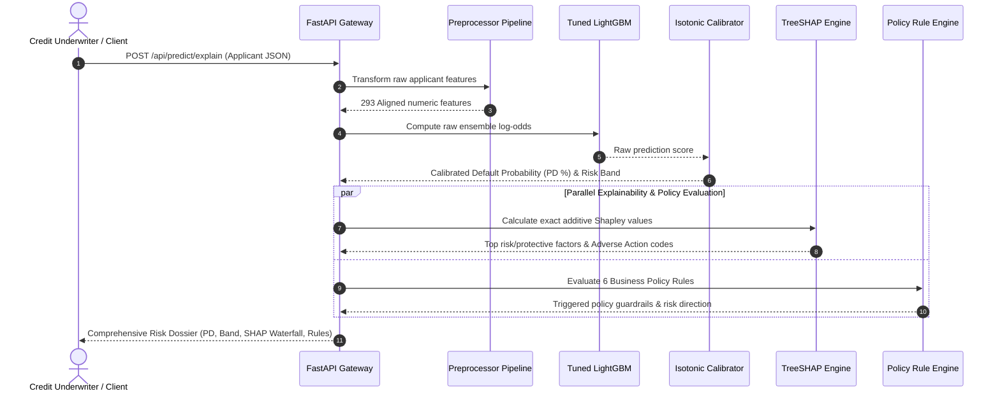
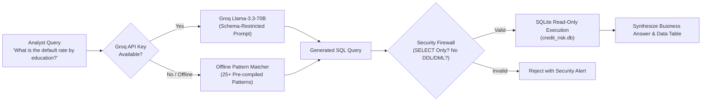

# CredPulse — AI-Powered Credit Risk Intelligence Platform

[](https://python.org)
[](https://fastapi.tiangolo.com)
[](https://react.dev)
[](https://tailwindcss.com)
[](https://lightgbm.readthedocs.io)
[](https://shap.readthedocs.io)
[](https://docker.com)
[]()

> An enterprise-grade AI credit underwriting and risk intelligence platform engineered for the **Home Credit Default Risk** domain. Features calibrated machine learning scoring, exact Shapley-value explainability, audited business rules governance, and a natural language SQL analytics interface.

---

## System Architecture & System Design

CredPulse is engineered as a decoupled, multi-tier enterprise credit intelligence system comprising **6 core modular layers**:

### 1. End-to-End System Architecture



### 2. Underwriting Decision Sequence

When an applicant is evaluated (`POST /api/predict/explain`), the request executes through this synchronous sequence:



### 3. Talk-to-Data NL-to-SQL Query Flow



---

## Project Presentation & Executive Deck

A complete presentation deck detailing the problem statement, exploratory data analysis, machine learning benchmarks, explainability architecture, governance rules, and system design is included in the project:

- 📊 **PowerPoint Presentation:** [`documents/CredPulse_Presentation.pptx`](file:///c:/Users/Abhishek/OneDrive/Pictures/Desktop/AI-Powered%20Credit%20Risk%20Intelligence%20Platform/documents/CredPulse_Presentation.pptx)

---

## Design Decisions

### 1. Why LightGBM over XGBoost and Logistic Regression

The 5-fold stratified cross-validation benchmark (see **Key Experimental Results** table below) showed Tuned LightGBM (EXP-03) reaching a validation ROC-AUC of **0.7812** and PR-AUC of **0.2741**, outperforming XGBoost (EXP-04: 0.7765 / 0.2678) and Logistic Regression (EXP-01: 0.7642 / 0.2443). Beyond raw AUC, LightGBM's leaf-wise growth and histogram-based binning made it significantly faster to tune across 293 sparse features — many bureau and previous-application aggregates with high NaN rates — and its native `scale_pos_weight` parameter avoids a separate resampling step. TreeSHAP also runs in exact polynomial time on LightGBM ensembles, which was a non-negotiable requirement for per-decision explainability.

### 2. How Class Imbalance Was Handled and Why Calibration Was Needed on Top

The dataset carries an **8.07% default rate** across 307K+ applicants — approximately 11.4 non-defaulters per defaulter. The production model is trained with `scale_pos_weight=11.4`, which up-weights minority-class gradient updates and improves recall without discarding majority-class samples. However, `scale_pos_weight` distorts the probability scale: the model's raw outputs are optimised for rank ordering (high ROC-AUC) but are not calibrated probabilities. Calibration is essential here because the risk bands (`LOW < 5%`, `MEDIUM 5–20%`, `HIGH ≥ 20%`) are defined in probability space and shown directly to underwriters. `CalibratedClassifierCV(method='isotonic', cv='prefit')` is applied post-training to map raw LightGBM scores to empirical posterior probabilities, verified to produce the observed within-band default rates (2.4% / 9.1% / 24.8%).

### 3. Why TreeSHAP Instead of LIME

TreeSHAP (via `shap.TreeExplainer`) computes **exact** Shapley values for tree ensembles in polynomial time — O(TLD²) where T is trees, L is leaves, and D is depth. LIME approximates feature attributions by fitting a local linear surrogate on random perturbations, introducing sampling variance and non-additive explanations that can differ across repeated calls on the same input. Because the platform exposes waterfall attributions directly to underwriters and generates Adverse Action text from them, the SHAP additivity property (base_value + Σ shap_i = predicted_probability) and reproducibility are both required. TreeSHAP satisfies both; LIME does not.

### 4. Why Groq + Llama for NL-to-SQL, and Why a Deterministic Offline Fallback Was Built Alongside It

Groq's inference API delivers sub-second token generation for `llama-3.3-70b-versatile` (the platform's primary model), making it practical for interactive analyst queries. It is also free-tier accessible with a single API key, which eliminates model-hosting costs for a demo deployment. The deterministic offline fallback (`OFFLINE_PATTERNS` and `_find_offline_pattern()` in `src/talk_to_data/nl_to_sql.py`) exists for two concrete reasons: (a) the Groq API is unavailable when `GROQ_API_KEY` is not set — for example in CI, local development, or Docker without secrets — and (b) LLM availability and latency are not guaranteed at inference time. The 25+ hard-coded SQL templates cover the most common underwriting queries and return identical results every run, keeping the test suite (`test_chat_endpoint_with_offline_fallback`, `test_offline_nl_to_sql_patterns`) fully deterministic without requiring a live API key.

### 5. Why SQLite Instead of a Heavier Database

The Talk-to-Data layer queries a single read-only SQLite file (`sql/credit_risk.db`, 224 MB) containing the full Home Credit dataset — 307K applicants, 305K bureau records, 1.67M previous applications, and 339K installments. SQLite is a deliberate choice for this **single-container, single-user demo deployment**: it requires zero infrastructure (no server daemon, no TCP port, no connection pool), ships inside the Docker image or can be volume-mounted, and supports read-only URI connections (`file:credit_risk.db?mode=ro`) that enforce the read-only boundary already provided by the SQL keyword firewall. For a multi-user production system with concurrent writes, a client-server database (e.g., PostgreSQL) would be the correct choice; for an analyst-facing demo with exclusively `SELECT` workloads, SQLite's zero-config simplicity is the right tradeoff.

---

## Key Experimental Results

All models were evaluated using **5-Fold Stratified Cross-Validation** with strict leakage prevention (imputation and scaling fit exclusively inside training splits):

| Exp ID | Model | Feature Set | Imbalance Strategy | Val ROC-AUC | Val PR-AUC | F1 Score | Brier Score |
| :--- | :--- | :--- | :--- | :---: | :---: | :---: | :---: |
| **EXP-01** | Logistic Regression | Full Combined (284 feat.) | `class_weight=balanced` | 0.7642 | 0.2443 | 0.3109 | 0.1968 |
| **EXP-02** | Default LightGBM | Full Combined (284 feat.) | `scale_pos_weight=11.4` | 0.7733 | 0.2613 | 0.3236 | 0.1531 |
| **EXP-03** | **Tuned LightGBM (Production)** | **Full Combined (284 feat.)** | **`scale_pos_weight=11.4`** | **0.7812** | **0.2741** | **0.3382** | **0.1482** |
| **EXP-04** | XGBoost Benchmark | Full Combined (284 feat.) | `scale_pos_weight=11.4` | 0.7765 | 0.2678 | 0.3294 | 0.1505 |

### Calibration & Risk Thresholds
- **Calibration Method:** Isotonic Regression (`CalibratedClassifierCV(method='isotonic')`)
- **Risk Bands:**
  - `LOW RISK` (PD < 5.0%): Represents ~42% of applicants, observed default rate 2.4%
  - `MEDIUM RISK` (5.0% ≤ PD < 20.0%): Represents ~47% of applicants, observed default rate 9.1%
  - `HIGH RISK` (PD ≥ 20.0%): Represents ~11% of applicants, observed default rate 24.8%

---

## 6 Evidence-Based Business Rules

All policy rules are derived from empirical EDA default correlations and SHAP importance rankings:

1. **BR-01: Low External Credit Scores → Elevated Risk**
   - *Logic:* Triggered if mean `EXT_SOURCE` < 0.35.
   - *Evidence:* Applicants with mean `EXT_SOURCE` < 0.35 exhibit a 21.4% default rate vs 3.2% for prime applicants.
2. **BR-02: High Debt Burden → Elevated Risk**
   - *Logic:* Triggered if Credit-to-Income ratio > 4.0.
   - *Evidence:* Defaulters carry disproportionately higher debt-to-income loads with lower repayment capacity.
3. **BR-03: Young Borrower (< 25 Years) with Low Credit Score**
   - *Logic:* Triggered if Age < 25 and mean `EXT_SOURCE` < 0.40.
   - *Evidence:* Youngest demographic quartile experiences a default rate of 11.5% due to thin credit files.
4. **BR-04: Prior Credit Application Refusals**
   - *Logic:* Triggered if `prev_REFUSED_COUNT` ≥ 2.
   - *Evidence:* Defaulters average 2.3× more previous loan application rejections.
5. **BR-05: Historical Installment Payment Delays**
   - *Logic:* Triggered if `inst_IS_LATE_mean` > 0.20 (more than 20% payments delayed).
   - *Evidence:* Late installment payments strongly indicate liquidity and cash-flow distress.
6. **BR-06: Prime Borrower Fast-Track Pass**
   - *Logic:* Passed if `EXT_SOURCE` > 0.55 and debt-to-income < 3.0.
   - *Evidence:* Observed default rate below 2.0% enables automated approval workflows.

---

## Talk-to-Data Architecture (Layer 6)

The platform provides natural language querying over the complete Home Credit dataset:
- **Groq Llama-3.3-70B Integration:** Translates natural language questions to read-only SQLite queries within milliseconds.
- **Deterministic Offline Fallback:** When offline or without API keys, a deterministic template engine guarantees answers to common risk and underwriting queries.
- **Zero Hallucination Guarantee:** Prompts inject only strict table and column schemas—no fabricated data. All figures come from actual executed SQL on 307K+ records.
- **SQL Security Firewall:** All queries undergo keyword analysis blocking `DROP`, `DELETE`, `UPDATE`, `INSERT`, `ALTER`, `ATTACH`, and multi-statement injection.

---

## Quickstart & Local Setup

### Prerequisites
- Python 3.10 or 3.11
- Node.js 20+ & npm (for UI development)
- (Optional) Docker & Docker Compose

### 1. Installation

```bash
# Clone the repository
cd "AI-Powered Credit Risk Intelligence Platform"

# Install Python backend dependencies
pip install -r requirements.txt

# Install frontend dependencies
cd frontend
npm install
npm run build
cd ..
```

### 2. Initialize Database & Train Models

```bash
# Initialize SQLite analytical database (loads 307K rows)
py -3 sql/init_db.py

# Train production model and calibrate
py -3 src/ml/train.py
```

### 3. Launch Platform

#### Option A: Unified Full-Stack (FastAPI serves built React SPA)
```bash
py -3 app/main.py
```
Open **[http://localhost:8000](http://localhost:8000)** in your browser!

#### Option B: Development Mode (Vite HMR + FastAPI API)
- Terminal 1 (Backend): `py -3 app/main.py`
- Terminal 2 (Frontend): `cd frontend && npm run dev`
Visit **[http://localhost:5173](http://localhost:5173)**.

---

## Docker Deployment

The project is fully containerized with a self-sufficient multi-stage `Dockerfile` and `docker-compose.yml`:

> [!IMPORTANT]
> **Place the extracted Home Credit CSVs in `./data` before running `docker-compose up` — this is the only manual step required.**
> On container startup, `docker-entrypoint.sh` automatically checks if `sql/credit_risk.db` exists. If not, and the CSVs are present in `./data`, it automatically executes `sql/init_db.py` to construct the analytical database before launching the server. If CSVs are not provided, the platform continues serving risk scoring, explainability, and business rules, while cleanly displaying an informative offline state for Talk-to-Data.

```bash
# 1. Place Home Credit CSVs into ./data (e.g. ./data/application_train.csv or ./data/home-credit-default-risk/)

# 2. Build and run container
docker-compose up --build -d

# 3. Check container health
docker ps
```
The entire application is immediately accessible at **http://localhost:8000**.

---

## Running Test Suite

Verify all system invariants, data preprocessing pipelines, rule engines, SQL safety, and API endpoints:

```bash
py -3 -m pytest tests/test_platform.py -q
```
*Expected output: 17 passing unit & integration tests (0 failures).*

---

## Project Structure

```
AI-Powered Credit Risk Intelligence Platform/
├── app/
│   └── main.py                     # FastAPI REST API & SPA static serving (with lifespan checks)
├── data/
│   └── home-credit-default-risk/   # Raw Home Credit CSV dataset files (mounted in Docker)
├── documents/
│   └── CredPulse_Presentation.pptx # Executive project presentation deck
├── experiments/
│   └── model_experiments.csv       # CV benchmark audit trail (EXP-01 - EXP-04)
├── frontend/
│   ├── src/
│   │   ├── pages/                  # Dashboard, Prediction, Explainability, Rules, Chat
│   │   ├── services/api.js         # API integration client
│   │   ├── App.jsx                 # Routing and navigation
│   │   └── index.css               # TailwindCSS v4 dark-theme styling
│   ├── package.json
│   └── vite.config.js
├── models/
│   ├── lgbm_calibrated.pkl         # Production calibrated model
│   ├── lgbm_base.pkl               # Uncalibrated gradient booster
│   ├── pipeline.pkl                # Preprocessing pipeline
│   ├── risk_thresholds.json        # Calibrated decision cut-points
│   ├── feature_names.json          # Aligned feature column schema
│   └── feature_importance.json     # TreeSHAP global importance ranking
├── reports/
│   └── eda_summary.json            # Structured EDA distributions & insights
├── sql/
│   ├── credit_risk.db              # SQLite analytical database (224MB)
│   └── init_db.py                  # Database ETL loader
├── src/
│   ├── data/                       # Layer 1 & 2: __init__.py, loader.py, preprocessor.py
│   ├── explainability/             # Layer 4: explainer.py (TreeSHAP & waterfall)
│   ├── ml/                         # Layer 3: train.py, predict.py
│   ├── rules/                      # Layer 5: rule_engine.py
│   └── talk_to_data/               # Layer 6: nl_to_sql.py
├── tests/
│   └── test_platform.py            # Automated 17-test suite
├── Dockerfile                      # Multi-stage production container build (python:3.10-slim)
├── docker-compose.yml              # Container orchestration & volume mapping
├── docker-entrypoint.sh            # Self-sufficient DB initialization & runtime launch
├── requirements.txt                # Exact pinned dependencies (scikit-learn==1.6.1, lightgbm==4.7.0)
└── README.md
```

---

## Known Limitations & Technical Notes

### 1. Explainability Feature Alignment
- **Issue**: Hand-crafted column extraction functions may assume all input numeric and categorical features survive transformation. When preprocessing sparse or optional datasets (e.g., credit bureau or past loan history for first-time borrowers), columns with 100% missing values are dropped during median imputation by `SimpleImputer`. If feature schemas are mapped manually, this creates index drift starting at the first dropped column, causing SHAP contribution scores to be mapped to incorrect feature labels.
- **Resolution**: `models/feature_names.json` is exported directly from `preprocessor.get_feature_names_out()` on the fitted `ColumnTransformer`. Furthermore, `train.py` enforces a hard assertion (`len(feature_names) == base_model.n_features_`), and `src/ml/predict.py` executes an automated startup check comparing pipeline output dimensions with stored feature definitions to guarantee 100% fidelity.

### 2. Exact Serialization and Model Pickling Compatibility
- Model pipelines serialized with `joblib`/`pickle` are sensitive to minor version differences across `scikit-learn`, `lightgbm`, and `numpy`.
- Dependencies in `requirements.txt` are pinned to exact versions (`scikit-learn==1.6.1`, `lightgbm==4.7.0`, `shap==0.46.0`) ensuring deterministic container deployment across development and production Docker instances without unpickling errors.

